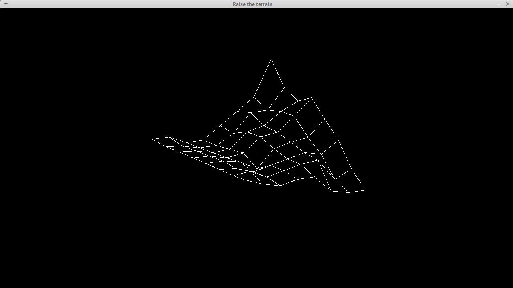

# Raise The Terrain

<div align="center">
  <p>
    Isometric projection of a square grid using the SDL2 Library and the C programming language.
  </p>
  <hr>
	<p>
		
		
	</p>
	<p>
		
		
	</p>
	<p>
		
	</p>
</div>
<hr>


[TOC]

## About

Projects a square grid isometrically and raises (or lowers) each z coordinate from 0 to the altitudes represented as an array given as an input from a file. Developed with the SDL2 graphic library and the C programming language.

## Compilation, usage and navigation

To compile this project you need to have the SDL2 library installed. If not, you can use the included shell script to install it. Change permissions to this file to run it if necessary:

```bash
sudo ./install_SDL2.sh
```

To compile this project on Linux, use this command:

```bash
gcc -Wall -Werror -Wextra -pedantic *.c -lm $(sdl2-config --cflags --libs) -o raise_the_terrain
```

To run the program on Linux, use the command:

```bash
./raise_the_terrain <file_name>
```

To interact with the grid, use the following control scheme:

|         Key          |                   Command                   |
| :------------------: | :-----------------------------------------: |
|         ESC          |                Quits program                |
|  W or Up Arrow key   |    Rotates grid clockwise in the x axis     |
| S or Down Arrow key  | Rotates grid counterclockwise in the x axis |
| D or Right Arrow key |    Rotates grid clockwise in the z axis     |
| A or Left Arrow key  | Rotates grid counterclockwise in the z axis |
|          E           |    Rotates grid clockwise in the y axis     |
|          Q           | Rotates grid counterclockwise in the y axis |
|   R or Page Up key   |                   Zoom in                   |
|  F or Page Down key  |                  Zoom out                   |
|          Z           |             Reinitializes view              |

# Author

## 👤 Alfredo Delgado Moreno

[](https://github.com/AlfredPianist/) [](https://twitter.com/Alfred_Pianist) [](https://www.linkedin.com/in/alfredo-delgado-moreno-75b65290/)